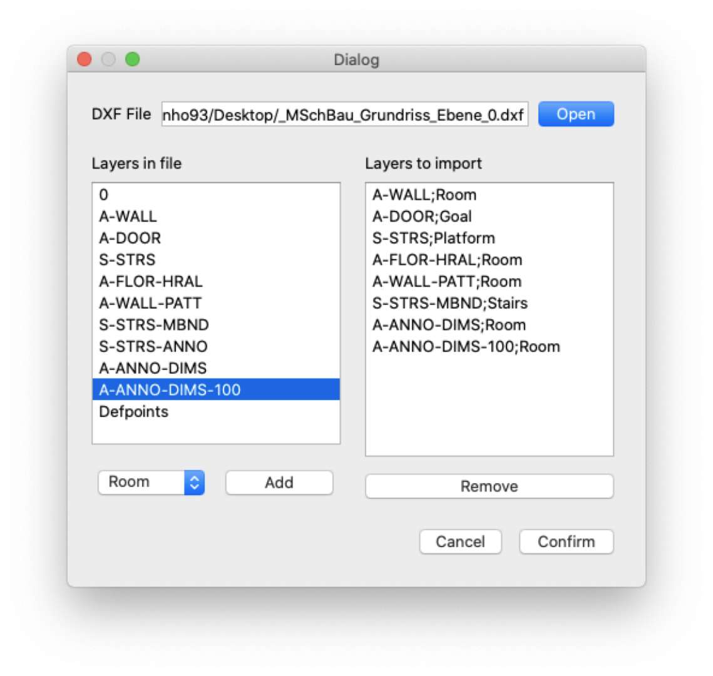

# DXF Importer

As discussed in [issue 215](https://github.com/JuPedSim/jpseditor/issues/215), JPSeditor can now read the layers in DXF file, 
and define the meaning of layers as room, transition or other JPSelement like in the following picture:

After the defining by importing, JPSeditor can translate the elements in layers as corresponding JPSelement.
